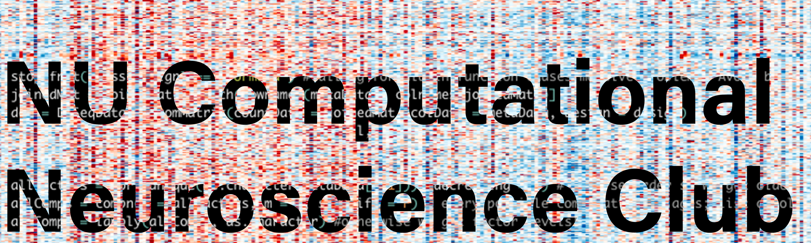

 
<h1 align="center">Welcome to Northwestern University Computational Neuroscience Club (NUCNC).</h1>

We meet on alternate Mondays 5-6PM to learn and discuss computational and theoretical neuroscience. Meetings include (but are not limited to) article/book chapter discussions, hackathons, tutorials, white board and round table discussions and invited talks. Meetings take place simultaneously on Evanston (Tech L251) and Chicago (Wieboldt 421) campuses (coordinated via videoconferencing) and are open to all NU PhD students, post-docs and faculty members interested/involved in computational neuroscience.

[Slack Signup](https://join.slack.com/t/northwesternc-zu85849/signup) | [Listserv](https://docs.google.com/forms/d/e/1FAIpQLSf8rmTx6HwFrrmUOqwWstThux6cRgty_mxYZPr9rKm6fysGDA/viewform?pli=1)
